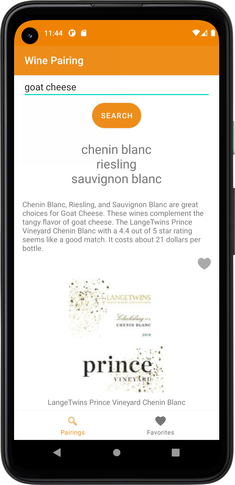

# WinePairingApp

An Android app that uses [Spoonacular API](https://spoonacular.com/food-api/docs#Wine-Pairingn) to offer wine pairing suggestions from user's inputted food, entree, or cuisine.

Minimum Api Level : 22

compileSdkVersion : 31

Build System : [Gradle](https://gradle.org/)

## Table of Contents

- [Requirements](#requirements)
- [Libraries](#libraries)
- [Demo](#demo)

###  Requirements
A spoonacular api key is required to run this app.

### Android Architecture Components
The application is built using MVVM Single-Activity Architecture with multiple fragments.

- LiveData
- ViewModel

### Concurrency

- Coroutines

## Libraries

#### Third-Party
- [Glide](https://github.com/bumptech/glide) - Image loading
- [Moshi](https://github.com/square/moshi) - JSON deserialization
- [Retrofit 2](https://square.github.io/retrofit/) - REST API access

## Demo

 

